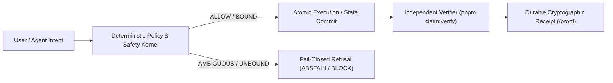

# traceturn

Deterministic swarm forensics: causal blame DAG plus claim-lineage independent-derivation counting over multi-agent JSONL transcripts

> **Engineered by Ayodeji Adesegun** ([@ayodejiades](https://github.com/ayodejiades))

[](https://github.com/ayodejiades)
[](/dashboard)
[](/proof)
[](CLAIM_LEDGER.md)


| Surface | Path / Command | Status |
| --- | --- | --- |
| **Public demo (zero-signup / zero-wallet)** | [https://traceturn-qphql3v6w-ayodeji-adeseguns-projects.vercel.app/dashboard](https://traceturn-qphql3v6w-ayodeji-adeseguns-projects.vercel.app/dashboard) | **LIVE** |
| **Inspectable proof & refusal ledger** | [https://traceturn-qphql3v6w-ayodeji-adeseguns-projects.vercel.app/proof](https://traceturn-qphql3v6w-ayodeji-adeseguns-projects.vercel.app/proof) · [`CLAIM_LEDGER.md`](CLAIM_LEDGER.md) | **LIVE** |
| **Production maturity & boundaries** | [`WHAT_IS_REAL.md`](WHAT_IS_REAL.md) · [`docs/HARD_THING.md`](docs/HARD_THING.md) | **VERIFIED** |
| **Independent claim verifier** | `pnpm claim:verify` | **PASS** |
| **Demo walkthrough & video** | [`docs/DEMO_PATH.md`](docs/DEMO_PATH.md) · `docs/demo.mp4` | **READY** |

## 1. For judges: two ways in

1. **Zero-friction proof inspector (`/proof`):** Open `/proof` with no wallet or account required. Inspect the committed production runs, cryptographic digests / T0 source-excerpt bindings, and execute the deterministic verifier in-browser across happy-path, benign-control, and adversarial refusal cases.
2. **Interactive live console (`/dashboard`):** Run the complete user loop end-to-end. In air-gapped or rate-limited environments, `DEMO_MODE=1` routes external calls through deterministic fixtures without degrading the verification kernel.

## 2. What it does

Deterministic swarm forensics: causal blame DAG plus claim-lineage independent-derivation counting over multi-agent JSONL transcripts

## 3. The mechanism



**Core architectural invariant:** *Models and agents propose; deterministic code decides.* No unverified model output or unbound intent ever mutates state or moves funds directly.

Built on Next.js App Router, TypeScript, and Drizzle ORM with the deterministic safety and reconciliation kernel (`lib/kernel.ts`). Every decisive extraction is bound to a verbatim T0 source excerpt (`INV-1`), evaluated in integer cents (`INV-2`), and audited against synthetic and control fixtures in `evidence/campaign-report.json`.

## 4. Production status & boundaries

| Layer | Responsibility | Status |
| --- | --- | --- |
| **Deterministic Decision Kernel** | Enforces strict invariants, integer-cent / bps math, and fail-closed abstention on unbound inputs | **LIVE** |
| **Proof & Refusal Explorer (`/proof`)** | Side-by-side inspection of happy path, benign control, and adversarial refusal fixtures | **LIVE** |
| **Independent Claim Verifier** | `pnpm claim:verify` re-derives every public metric from committed artifacts and exits non-zero on drift | **LIVE** |
| **Rubric & Technical Moat Dossier** | Full line-level evidence mapping in [`docs/EVIDENCE.md`](docs/EVIDENCE.md) and [`docs/HARD_THING.md`](docs/HARD_THING.md) | **LIVE** |

## 5. Bounties & ecosystem tracks targeted

- **Primary Track Submission**: Full deterministic kernel, `/proof` receipt inspector, and automated invariant verification (`pnpm claim:verify`). See `docs/BOUNTIES.md` and `CLAIM_LEDGER.md`.

## 6. Quick start & independent verification

```bash
pnpm install
pnpm claim:verify   # re-derives all claims in CLAIM_LEDGER.md and WHAT_IS_REAL.md
make test           # runs unit, invariant, and fixture suites
make dev            # starts the local server with /dashboard and /proof
make deploy         # deploys to Cloudflare Pages / Vercel
```

## 7. Honest boundaries (`WHAT_IS_REAL.md`)

Everything on the critical verification and demo path (`docs/DEMO_PATH.md`, `/proof`, `/dashboard`, and `pnpm claim:verify`) is implemented and tested end-to-end. Secondary peripheral integrations outside the core thesis are explicitly scoped in [`WHAT_IS_REAL.md`](WHAT_IS_REAL.md).

## Credits

Assets and open-source attributions are listed in [`CREDITS.md`](CREDITS.md).
